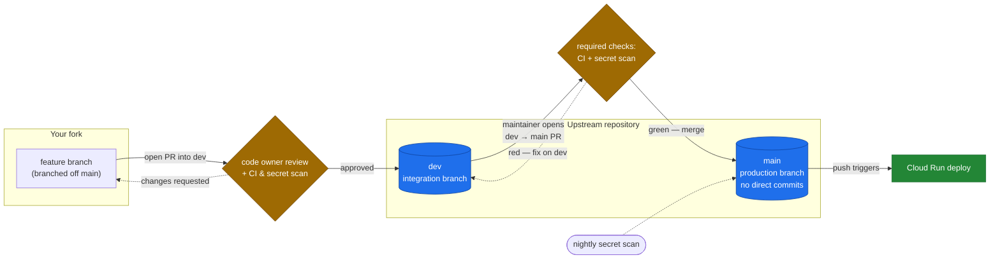

# Contributing to Markdown to Docs

Thanks for taking the time to contribute. If you've found a bug or have a feature request, check whether an issue already exists for it; if not, open one.

## How can I contribute?

### Reporting Bugs
A good bug report lets a maintainer reproduce the problem without guessing:
- Use a clear, descriptive title.
- Describe the exact steps to reproduce, in as much detail as you can.
- Include concrete examples (the input file, the command, a screenshot of the result).

### Suggesting Enhancements
For new features and improvements to existing ones:
- Use a clear, descriptive title.
- Describe the behavior you'd like, step by step.
- Explain why it would be useful to most users, not just your setup.

### Pull Requests
We actively welcome your pull requests. **All changes flow through the `dev` branch; `main` never takes direct commits or PRs from feature branches** (see [Branching model](#branching-model--branch-protection) below).
1. Fork the repo and clone it (the default branch is `main`); create your feature branch from **`main`**.
2. Follow the development setup instructions below / in the `README.md`.
3. If you've added code that should be tested, add tests.
4. If you've changed APIs or core features, update the documentation.
5. Ensure the test suite passes (`npm test`) and your code lints (`npm run lint`).
6. Open your pull request **against the `dev` branch**.
7. The repo owner reviews and approves; only the owner's approval can merge it.

## Branching model & branch protection

This project uses a two-tier branch model, enforced by GitHub branch rulesets:

- **`main`**: the production / deploy branch (a push to `main` triggers the Cloud Run deploy).
  - **No direct commits**: changes land only via pull request.
  - Force-pushes and branch deletion are blocked.
  - A PR can be merged **only after CI and the secret scan pass**.
  - PRs into `main` come **only from `dev`**, and are opened by the maintainer.
- **`dev`**: the integration branch where contributions are collected.
  - Branch deletion is blocked (direct commits by the maintainer are allowed).
  - PRs into `dev` **require review from the code owner**; only the repo owner's
    approval satisfies it (see [CODEOWNERS](CODEOWNERS)).

**Contribution flow:**



1. Branch off `main` in your fork, make your changes, and open a PR **into `dev`** (the PR's *target* is `dev`, even though you branched from `main`).
2. The repo owner reviews and approves; on merge, your work lands in `dev`.
3. The maintainer periodically opens a `dev → main` PR, which merges only when CI passes, and that merge deploys to production.

> CI and secret scanning run automatically on every push/PR to non-`main` branches; `main` itself is scanned on a nightly schedule.

## Local Development Setup

1. **Clone the repository:**
   ```bash
   git clone https://github.com/AlisterBaroi/markdown-to-google-docs-mcp.git
   cd markdown-to-google-docs-mcp
   ```
   (When contributing, clone your **fork**'s URL instead.)

2. **Install dependencies:**
   ```bash
   npm install
   ```

3. **Environment Variables:**
   Copy the `.env.example` file to `.env` and fill in your Firebase configuration.
   ```bash
   cp .env.example .env
   ```

4. **Run the local development server:**
   ```bash
   npm run dev
   ```
   The app will be available at `http://localhost:3000`.

## Code Style
- We use Prettier/ESLint for code formatting and linting.
- Please make sure your code passes linting before submitting a PR: `npm run lint`

## Code of Conduct
Please note that this project is released with a [Contributor Code of Conduct](CODE_OF_CONDUCT.md). By participating in this project you agree to abide by its terms.

Thank you for your contributions!
