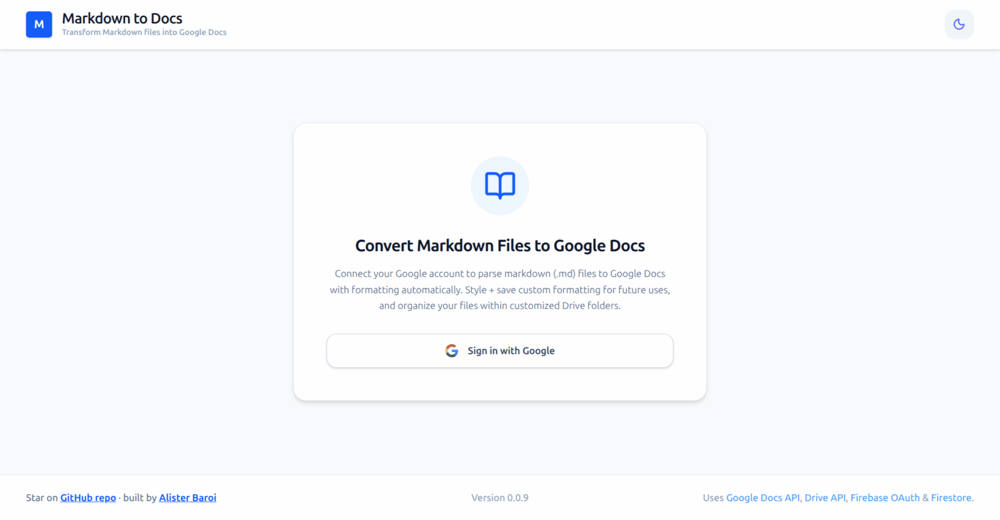
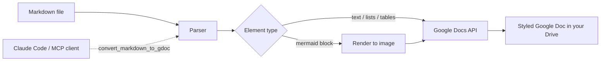

# Markdown → Google Docs 📝➡️📄

**An open-source Markdown to Google Docs converter — use the web app, _or_ let your AI agent (Claude Code) generate Docs for you over MCP.**

Drop in `.md` files and get clean, beautifully styled Google Docs in your Drive — headings, lists, tables, bold/italic, code blocks, and even **rendered Mermaid diagrams**. It also runs as a **Model Context Protocol (MCP) server**, so **Claude Code** (or any MCP client) can write formatted Google Docs straight to your Drive from a conversation.

<!-- Badges render once the repo is public -->
[](https://github.com/AlisterBaroi/markdown-to-google-docs-mcp/actions/workflows/ci.yml)
[](https://github.com/AlisterBaroi/markdown-to-google-docs-mcp/actions/workflows/secret-scan.yml)
[](LICENSE)
[](.github/CONTRIBUTING.md)

<!-- SEO / discoverability: set these as repo "Topics" in Settings →
     markdown, google-docs, google-drive, markdown-to-google-docs, mcp,
     model-context-protocol, claude, claude-code, mermaid, react, typescript, firebase -->


> _Built with React 19 + Vite, an Express backend, the Google Docs & Drive APIs, and the Model Context Protocol._

## Why?

Markdown is where ideas get written; Google Docs is where teams review and share them. Copy-pasting between the two destroys formatting and wastes time. **Markdown → Docs** does the conversion faithfully — and uniquely, it works **two ways**:

1. **As a web app** — drag, drop, convert, done.
2. **As an MCP server** — let Claude Code (or Claude Desktop) generate a styled Google Doc directly from a conversation, using your own Drive.

## ✨ Features

- **📄 Faithful Markdown → Google Docs** — headings, bold/italic/underline/strikethrough, ordered & unordered lists, tables, horizontal rules, and code blocks.
- **🧜 Mermaid diagrams → real images** — fenced ` ```mermaid ` blocks are rendered and embedded as images in the doc (rendered locally, never sent to a third-party service).
- **🎨 Typography presets** — configure fonts, sizes, spacing, and colors per element; reuse them across conversions.
- **📁 Drive folder browser** — navigate, search, and create folders in the UI to pick exactly where docs land.
- **🤖 MCP server for AI agents** — connect Claude Code / Claude Desktop and convert Markdown to Docs from a prompt. A live **Connected Agents** panel shows which clients are attached (OS, uptime, session).
- **🔐 Google OAuth with silent refresh** — Firebase sign-in plus background token refresh, so long sessions don't break mid-work.
- **🌗 Modern UI** — Tailwind CSS, dark/light mode, micro-interactions.

## 🧭 How it works



## 🚀 Quickstart

### Prerequisites
- **Node 20+**
- A **Firebase project** with Google sign-in enabled
- A **Google Cloud** OAuth 2.0 Web client, with the **Google Docs API** and **Google Drive API** enabled

### 1. Clone & install
```bash
git clone https://github.com/AlisterBaroi/markdown-to-google-docs-mcp.git
cd markdown-to-google-docs-mcp
npm install
```

### 2. Configure environment
Copy `.env.example` to `.env` and fill in your Firebase web config and OAuth client ID:

```env
VITE_FIREBASE_API_KEY=...
VITE_FIREBASE_AUTH_DOMAIN=your-project.firebaseapp.com
VITE_FIREBASE_PROJECT_ID=your-project
VITE_FIREBASE_STORAGE_BUCKET=your-project.appspot.com
VITE_FIREBASE_MESSAGING_SENDER_ID=...
VITE_FIREBASE_APP_ID=...
VITE_FIREBASE_MEASUREMENT_ID=...
# OAuth 2.0 Web client ID — used for silent token refresh (Google Identity Services)
VITE_GOOGLE_CLIENT_ID=...apps.googleusercontent.com
```

> **Two allowlists you must set in Google Cloud / Firebase** (they're separate and both required):
> - **Firebase → Authentication → Authorized domains**: add the host you run on (`localhost`, your deploy domain).
> - **Google Cloud → Credentials → your OAuth Web client → Authorized JavaScript origins**: add the exact origin (e.g. `http://localhost:3000`). Missing this causes `Error 400: origin_mismatch` on sign-in/refresh.
>
> **Restricting who can sign in (by email domain):** this is configured in the **Google / Firebase console**, not in app code. To limit sign-in to your organization (e.g. only `@your-company.com`), set the **OAuth consent screen** user type to **Internal** (Google Workspace org-only) in Google Cloud Console. The `EMAIL_DOMAIN` value in `.env.example` is a placeholder and is **not** enforced by the app.

### 3. Run
```bash
npm run dev
```
Open **http://localhost:3000**, sign in with Google, drop in a `.md` file, and convert.

## 🤖 Use it from Claude Code (MCP)

This app doubles as a remote MCP server. After signing in, open the in-app **MCP setup page** (`/mcp`) to get your personal connection token and the exact `claude mcp add …` command, then ask your agent:

> _"Convert README.md to a Google Doc using markdown-to-gdocs."_

The server exposes a `convert_markdown_to_gdoc` tool that creates a styled doc in your Drive and returns the link. The MCP page also lists your currently connected agents in real time.

## 🛠️ Tech stack

| Layer | Tech |
|---|---|
| Frontend | React 19, TypeScript, Vite 6, Tailwind CSS |
| Backend | Node 20, Express (bundled with esbuild) |
| Google APIs | Docs API v1, Drive API v3 |
| Auth | Firebase Google sign-in + Google Identity Services (silent refresh) |
| Diagrams | Mermaid (browser-side, plus headless Chromium server-side for the MCP path) |
| AI integration | Model Context Protocol (SSE transport) |
| Tooling | Vitest, GitHub Actions, gitleaks |

## 📦 Build & deploy

```bash
npm run build   # builds the client (Vite) and bundles the server (esbuild) into dist/
npm start       # runs the production server: node dist/server.cjs
```

Production runs as a **Node/Express server** (it serves the built client *and* the API/MCP endpoints) — it is **not** a static-only SPA. A `Dockerfile` is included (Node + Chromium for server-side Mermaid rendering).

**Deploying to Cloud Run:** a ready-to-use Cloud Build pipeline ([`cloudbuild.yaml`](cloudbuild.yaml))
builds, pushes, and deploys on every push to `main`. See **[docs/CloudRun_Deployment.md](docs/CloudRun_Deployment.md)**
for the full step-by-step guide (Artifact Registry, trigger setup, substitution variables, making the
service public, and registering the URL). Key points:
- The server listens on `$PORT` (Cloud Run injects `8080`).
- Allocate **~2 GB memory** (headless Chromium for Mermaid is heavy).
- Use **`--max-instances=1`** — MCP session state and the temporary diagram-image host live in memory, so the SSE connection and its callbacks must hit the same instance.
- The `VITE_*` Firebase values are **build-time** substitution variables (baked into the bundle by Cloud Build), not runtime env vars.
- Add your Cloud Run URL to **both** allowlists (Firebase Authorized domains *and* the OAuth client's Authorized JavaScript origins).

**Other deployment targets:**
- **Kubernetes / GKE** → [docs/GKE_Deployment.md](docs/GKE_Deployment.md) — Deployment + Service + Ingress manifests, with managed TLS.
- **Local Kubernetes (kind)** → [docs/Local_Kubernetes_Deployment.md](docs/Local_Kubernetes_Deployment.md) — for testing the manifests locally (note: Mermaid embedding needs a public URL, so it won't render on `localhost`).

## ✅ Tests & CI

```bash
npm test        # Vitest: parser unit tests + a server E2E (boots the built server)
```
GitHub Actions runs **build + tests** and a **gitleaks secret scan** on every push/PR to non-`main` branches, and nightly on `main`. (`main` is protected: changes land only via PR, and merges require CI to pass — see the [Contributing guide](.github/CONTRIBUTING.md).)

## 🤝 Contributing

Contributions are welcome! Please read the [Contributing guide](.github/CONTRIBUTING.md) and our [Code of Conduct](.github/CODE_OF_CONDUCT.md). To report a vulnerability, see the [Security policy](.github/SECURITY.md).

## ⭐ Support

If this saved you some copy-pasting, **star the repo** — it genuinely helps others find it.

## 📄 License

[MIT](LICENSE) © [Alister Baroi](https://github.com/AlisterBaroi)
