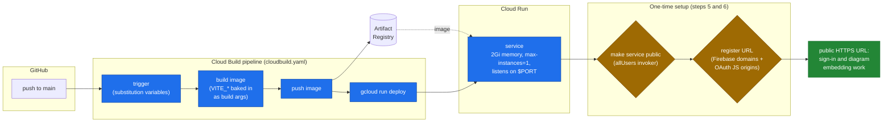

# Deploying to Google Cloud Run

This guide explains how to configure [`cloudbuild.yaml`](../cloudbuild.yaml) and deploy your own
instance of **Markdown → Docs** to Google Cloud Run, using Cloud Build for CI/CD from GitHub.

The pipeline does three things: **build** the Docker image → **push** it to Artifact Registry →
**deploy** it to Cloud Run. All project-specific values are supplied as **substitution variables**
(never hardcoded in the repo), so the same `cloudbuild.yaml` works for anyone.



---

## 1. Prerequisites

- A **Google Cloud project** with billing enabled, and the [`gcloud` CLI](https://cloud.google.com/sdk/docs/install).
- A **Firebase project** (can be the same GCP project) with **Google sign-in** enabled; see the
  [main README](../README.md#quickstart) for the Firebase/OAuth setup.
- Enable the required APIs:
  ```bash
  gcloud services enable \
    run.googleapis.com \
    cloudbuild.googleapis.com \
    artifactregistry.googleapis.com \
    docs.googleapis.com \
    drive.googleapis.com
  ```

## 2. Create an Artifact Registry repo

The image is pushed here. Pick a region (used everywhere below):

```bash
gcloud artifacts repositories create cloud-run-source-deploy \
  --repository-format=docker \
  --location=us-central1
```

## 3. Configure the substitution variables

`cloudbuild.yaml` reads everything from substitution variables. You provide them either in the
**Cloud Build trigger UI** (recommended, see step 4) or on the command line (step 6).

**Infrastructure values:**

| Variable | Example | Meaning |
|---|---|---|
| `_AR_PROJECT_ID` | `my-gcp-project` | Your GCP project ID |
| `_AR_HOSTNAME` | `us-central1-docker.pkg.dev` | Artifact Registry host (**must match your region**) |
| `_AR_REPOSITORY` | `cloud-run-source-deploy` | The Artifact Registry repo from step 2 |
| `_DEPLOY_REGION` | `us-central1` | Cloud Run + Artifact Registry region |
| `_SERVICE_NAME` | `md-to-docs` | Your Cloud Run service name |
| `REPO_NAME` | `your-repo` | Auto-provided for repo-connected triggers; set manually for CLI builds |

**Build-time app config (`VITE_*`)**: these are inlined into the client bundle at build time, so
they **must** be set here (setting them as Cloud Run *runtime* env vars does nothing). They're public
web-config values (they ship in the client bundle), not secrets:

```
_VITE_FIREBASE_API_KEY
_VITE_FIREBASE_AUTH_DOMAIN
_VITE_FIREBASE_PROJECT_ID
_VITE_FIREBASE_STORAGE_BUCKET
_VITE_FIREBASE_MESSAGING_SENDER_ID
_VITE_FIREBASE_APP_ID
_VITE_FIREBASE_MEASUREMENT_ID   # optional
_VITE_GOOGLE_CLIENT_ID
```

> **Don't hardcode these into `cloudbuild.yaml`.** The repo's secret-scan (gitleaks) flags
> hardcoded substitution values. Keep them in the trigger / CLI flags.

## 4. Create the Cloud Build trigger (CI/CD from GitHub)

1. Connect your GitHub repo: **Cloud Build → Triggers → Connect Repository**.
2. **Create a trigger**:
   - **Event:** Push to a branch → `^main$`
   - **Configuration:** *Cloud Build configuration file (YAML or JSON)*, location **`/cloudbuild.yaml`**
   - **Substitution variables:** add every variable from step 3 with your values.
3. Save. Now every push to `main` builds and deploys automatically.

## 5. First deploy: make the service public

`cloudbuild.yaml` deliberately does **not** set public access (so the pipeline doesn't fail on orgs
that restrict it). After your first successful deploy, make the service reachable **once**:

```bash
# Standard: allow public (unauthenticated) access
gcloud run services add-iam-policy-binding md-to-docs \
  --region=us-central1 \
  --member=allUsers \
  --role=roles/run.invoker
```

> **Org policy note:** if your organization enforces *Domain Restricted Sharing*
> (`iam.allowedPolicyMemberDomains`), the `allUsers` binding is blocked. Ask an org admin to grant a
> policy exception for the project, or expose the service another way (e.g. a load balancer with IAP).
> Symptom of a private service: a `403 Forbidden` page saying the request was not authenticated.

## 6. Post-deploy: register the Cloud Run URL

Google sign-in checks two **separate** allowlists. Add your Cloud Run URL to **both**:

- **Firebase Console → Authentication → Settings → Authorized domains** → add `YOUR-SERVICE-xxxx.run.app`
- **Google Cloud Console → APIs & Services → Credentials → your OAuth Web client → Authorized
  JavaScript origins** → add `https://YOUR-SERVICE-xxxx.run.app`

Missing the second one causes `Error 400: origin_mismatch` on sign-in / token refresh.

### Restricting who can sign in (by email domain)

The app itself does **not** enforce an email-domain allowlist (the `EMAIL_DOMAIN` entry in
`.env.example` is a placeholder and is not read by the code). Restrict sign-in at the **Google /
Firebase console** instead:

- To allow **only your organization** (e.g. `@your-company.com`): set the **OAuth consent screen**
  user type to **Internal** in Google Cloud Console → APIs & Services → OAuth consent screen. Only
  users in your Google Workspace org will be able to sign in; outside accounts (e.g. personal Gmail)
  are rejected automatically.
- For finer-grained control, use a [Firebase Authentication blocking function](https://firebase.google.com/docs/auth/extend-with-blocking-functions)
  (`beforeUserCreated` / `beforeUserSignedIn`) to reject emails that don't match your allowed domain(s).

## 7. Deploy without a trigger (manual / one-off)

You can run the same pipeline from your machine, passing substitutions inline:

```bash
gcloud builds submit --config=cloudbuild.yaml \
  --substitutions=\
_AR_PROJECT_ID=my-gcp-project,\
_AR_HOSTNAME=us-central1-docker.pkg.dev,\
_AR_REPOSITORY=cloud-run-source-deploy,\
_DEPLOY_REGION=us-central1,\
_SERVICE_NAME=md-to-docs,\
REPO_NAME=local,\
_VITE_FIREBASE_API_KEY=...,\
_VITE_FIREBASE_AUTH_DOMAIN=your-project.firebaseapp.com,\
_VITE_FIREBASE_PROJECT_ID=your-project,\
_VITE_FIREBASE_STORAGE_BUCKET=your-project.appspot.com,\
_VITE_FIREBASE_MESSAGING_SENDER_ID=...,\
_VITE_FIREBASE_APP_ID=...,\
_VITE_GOOGLE_CLIENT_ID=...apps.googleusercontent.com
```

## Notes & tuning

- **Memory `2Gi`** is set because server-side Mermaid rendering runs headless Chromium (heavy). Lower
  values can OOM during diagram conversion.
- **`--max-instances=1`** is set because the MCP session state and the temporary diagram-image host
  live in memory; the SSE connection and its callbacks must reach the same instance. If you don't use
  the MCP server, you can raise this.
- **`--min-instances=1`** (commented out in `cloudbuild.yaml`) keeps synced MCP sessions warm across
  requests; scale-to-zero loses in-memory state. It costs an always-on instance, so enable it only if needed.
- **`--no-cache`** in the build step guarantees fresh builds; remove it for faster incremental builds.

## Troubleshooting

| Symptom | Cause | Fix |
|---|---|---|
| `403 Forbidden / not authenticated` | Service is private | Step 5 (make public) |
| Sign-in: `apiKey is missing` | `VITE_*` not passed at build | Set the `_VITE_*` substitutions (step 3) |
| Sign-in: `Error 400: origin_mismatch` | Origin not authorized | Add the URL to OAuth JS origins (step 6) |
| `Service not found` on deploy | n/a | `cloudbuild.yaml` uses `gcloud run deploy`, which creates the service; ensure the region/name are correct |
| Mermaid diagrams blank in the doc | Image URL unreachable / OOM | Ensure the service is public and has `2Gi` memory |
